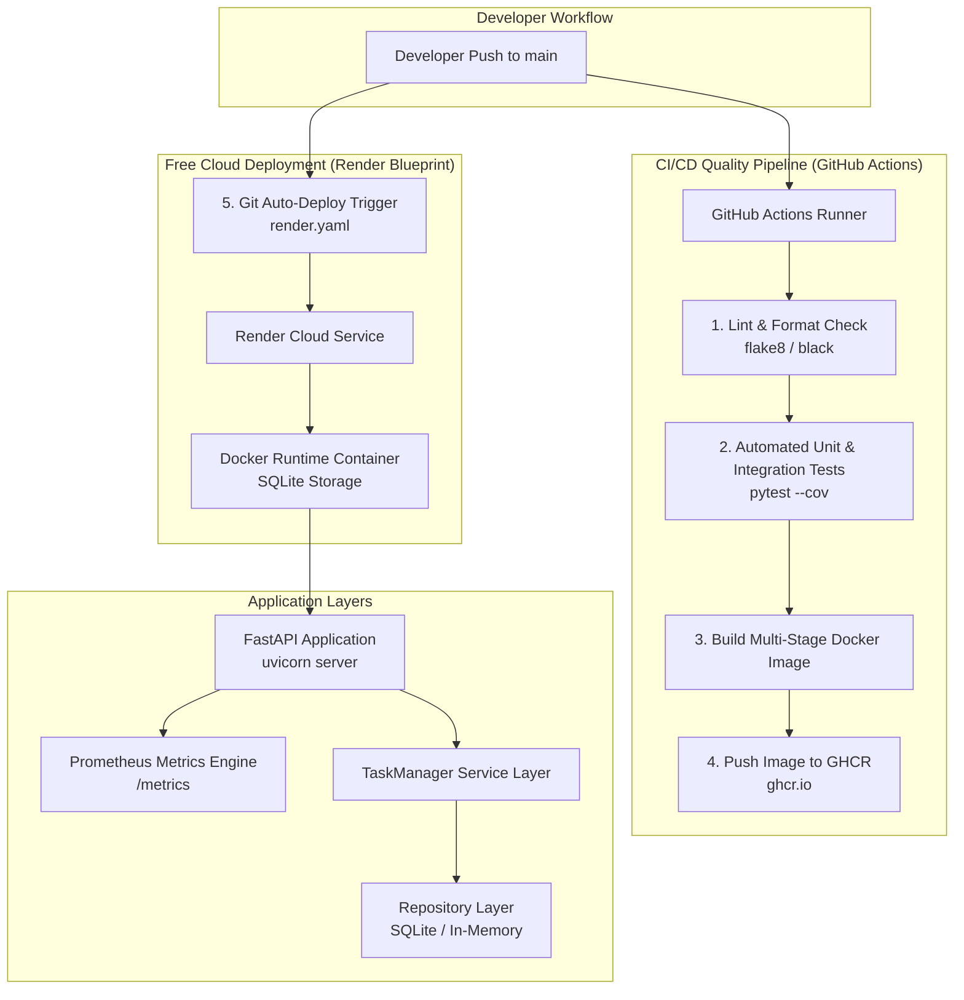

# 🚀 Task Manager REST API & Free Render CI/CD Pipeline

[](https://github.com/your-username/task-manager-api/actions/workflows/ci-cd.yml)


A production-style **Task Manager REST API** built with Python and **FastAPI** using strict **Object-Oriented Programming (OOP)**, the **Repository Pattern** (`SQLiteTaskRepository` & `InMemoryTaskRepository`), **Prometheus Metrics**, **Pytest**, **Multi-stage Dockerization**, and a zero-cost **Render Git Auto-Deployment Pipeline** (no credit card required).

---

## 🌐 Live Application & Web Dashboard Deployment

- **Vercel Frontend Deployment:** `https://temporary-turbo-neon-h4j4ucy.vercel.app`
- **Render Monolith Web App:** `https://task-manager-api-l6ne.onrender.com/`
- **Backend REST API Endpoint:** `https://task-manager-api-l6ne.onrender.com`
- **Interactive Swagger Docs:** `https://task-manager-api-l6ne.onrender.com/docs`
- **Health Check Endpoint:** `https://task-manager-api-l6ne.onrender.com/health`
- **Prometheus Metrics:** `https://task-manager-api-l6ne.onrender.com/metrics`

---

## 🏗 System Architecture & CI/CD Workflow

The diagram below illustrates the developer workflow, automated GitHub Actions testing/linting pipeline, and Render's zero-card Git-triggered container deployment flow:



---

## ✨ Features & Design Highlights

1. **Object-Oriented Architecture (OOP):**
   - **`Task` Domain Class:** Encapsulates state, business validation rules, priority levels, and timestamp tracking.
   - **`TaskManager` Service Class:** Pure CRUD domain service layer decoupled from HTTP router logic.
   - **Repository Pattern:** Abstract `BaseTaskRepository` interface supporting:
     - `SQLiteTaskRepository` (Class-based SQLite persistence)
     - `InMemoryTaskRepository` (Thread-safe dict with Lock)
   - **Custom Exceptions:** Domain exceptions (`TaskNotFoundError`, `TaskValidationError`, `DuplicateTaskError`, `RepositoryError`) mapped cleanly to HTTP status codes.

2. **Testing & Code Quality:**
   - 30 unit and integration tests covering domain models, repositories, service layer, and FastAPI endpoints.
   - 90% code coverage enforced via `pytest-cov`. Full compliance with `flake8` and `black`.

3. **Multi-Stage Dockerization:**
   - Optimized multi-stage Docker build producing small, secure runtime images.
   - Runs under a non-root user (`appuser`) with an integrated Docker `HEALTHCHECK`.

4. **100% Free Cloud Deployment (Zero Credit Card):**
   - Uses Render's Blueprint (`render.yaml`) for automatic Git-triggered deployments on every push to `main`.
   - Uses `SQLiteTaskRepository` for persistent file-based data access without requiring paid or time-expiring managed database instances.

5. **Prometheus Monitoring:**
   - Exposes metrics at `/metrics` tracking request counts, request latency histograms, active connections, and total task gauge.

6. **Linux Bash Automation:**
   - `scripts/deploy.sh`: Script for local container build, deployment, status check, and rollback.
   - `scripts/health_check.sh`: Script curling `/health` with retries and JSON validation.

---

## 📁 Repository Structure

```
.
├── .github/
│   └── workflows/
│       └── ci-cd.yml             # GitHub Actions CI/CD Pipeline
├── app/
│   ├── api/
│   │   ├── dependencies.py       # FastAPI Dependency Injection
│   │   └── routes.py             # REST API Task Endpoints
│   ├── models/
│   │   └── task.py               # Domain Model & Pydantic DTOs
│   ├── repositories/
│   │   ├── base.py               # Abstract Base Repository
│   │   ├── in_memory.py          # Thread-Safe In-Memory Repository
│   │   └── sqlite.py             # Class-Based SQLite Repository
│   ├── services/
│   │   └── task_manager.py       # TaskManager CRUD Service
│   ├── config.py                 # Application Settings
│   ├── exceptions.py             # Domain Exceptions
│   ├── main.py                   # FastAPI Application Entrypoint
│   └── metrics.py                # Prometheus Telemetry Setup
├── scripts/
│   ├── deploy.sh                 # Linux Bash Deployment & Rollback Script
│   └── health_check.sh           # Linux Bash Health Verification Script
├── terraform/                    # (Optional AWS IaC Reference)
│   ├── main.tf
│   ├── variables.tf
│   └── outputs.tf
├── tests/
│   ├── conftest.py               # Pytest Fixtures
│   ├── test_api.py               # Integration API Tests
│   ├── test_models.py            # Domain Model Unit Tests
│   ├── test_repositories.py      # Repository Unit Tests
│   └── test_task_manager.py      # TaskManager Unit Tests
├── .dockerignore
├── .flake8
├── docker-compose.yml            # Lightweight Local Development Setup (SQLite)
├── Dockerfile                    # Multi-Stage Production Dockerfile
├── pyproject.toml                # Black & Pytest Settings
├── render.yaml                   # Free Render Blueprint Configuration
├── requirements.txt              # Production Dependencies
├── requirements-dev.txt          # Development & Testing Dependencies
└── README.md                     # Project Documentation
```

---

## 🛠 Local Setup & Running

### Option 1: Python Virtual Environment

```bash
# 1. Clone Repository
git clone https://github.com/your-username/task-manager-api.git
cd task-manager-api

# 2. Create and Activate Virtual Environment
python3 -m venv venv
source venv/bin/activate

# 3. Install Dependencies
pip install -r requirements-dev.txt

# 4. Run Pytest Suite
pytest

# 5. Start Application Server
python -m uvicorn app.main:app --reload --port 8000
```
Access Swagger UI at [http://localhost:8000/docs](http://localhost:8000/docs).

---

### Option 2: Docker Compose (Lightweight Local Container)

```bash
# Build and run API container with SQLite storage
docker-compose up --build -d

# View container logs
docker-compose logs -f api

# Stop container
docker-compose down
```

---

## 🚀 Linux Bash Automation Scripts

Ensure executable permissions are set:
```bash
chmod +x scripts/deploy.sh scripts/health_check.sh
```

### 1. Manual Deployment & Rollback (`scripts/deploy.sh`)

```bash
# Build, run container, and perform post-deploy health check
./scripts/deploy.sh --deploy

# Check running container status and health
./scripts/deploy.sh --status

# Rollback to previous container backup image
./scripts/deploy.sh --rollback
```

### 2. Health Verification Script (`scripts/health_check.sh`)

```bash
# Ping local health endpoint
./scripts/health_check.sh "http://localhost:8000"

# Ping live Render deployment
./scripts/health_check.sh "https://task-manager-api-cloud.onrender.com"
```

---

## 🔌 REST API Reference Table

| Method | Endpoint | Description | Status Code |
| :--- | :--- | :--- | :--- |
| `GET` | `/health` | Application & DB Health Status | `200 OK` |
| `GET` | `/metrics` | Prometheus Metrics Payload | `200 OK` |
| `GET` | `/tasks` | List Tasks (supports `completed`, `limit`, `offset`) | `200 OK` |
| `POST` | `/tasks` | Create New Task | `201 Created` |
| `GET` | `/tasks/{id}` | Retrieve Task by ID | `200 OK` / `404 Not Found` |
| `PUT` | `/tasks/{id}` | Update Task details | `200 OK` / `404 Not Found` |
| `DELETE` | `/tasks/{id}` | Delete Task by ID | `204 No Content` / `404 Not Found` |

---

## 📄 License

This project is licensed under the [MIT License](LICENSE).
